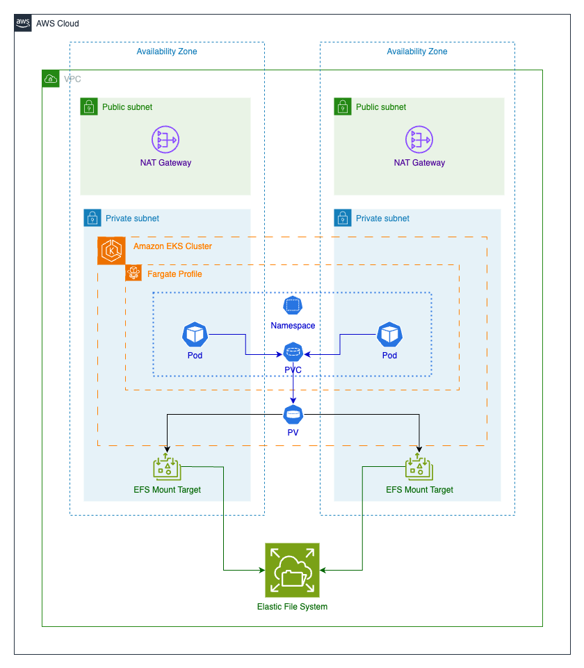

# Persistence Configuration with Amazon EFS on Amazon EKS using AWS Fargate

This pattern provides the step-by-step guidance for enabling **Amazon Elastic File System (EFS)** as storage for containers running on **Amazon Elastic Kubernetes Service (EKS)**, using **AWS Fargate (Fargate)**.

## Summary

This pattern provides guidance for enabling **Amazon Elastic File System (Amazon EFS)** as a storage device for containers that are running on **Amazon Elastic Kubernetes Service (Amazon EKS)**, using **AWS Fargate** to provision your compute resources.

The setup described in this pattern follows security best practices and provides security at rest and security in transit by default. To encrypt your Amazon EFS file system, it uses an AWS Key Management Service (AWS KMS) key, but you can also specify a key alias that dispatches the process of creating a KMS key.

You can follow the steps in this pattern to create a namespace and Fargate profile for a proof-of-concept (PoC) application, install the Amazon EFS Container Storage Interface (CSI) driver that is used to integrate the Kubernetes cluster with Amazon EFS, configure the storage class, and deploy the PoC application. These steps result in an Amazon EFS file system that is shared among multiple Kubernetes workloads, running over Fargate. The pattern is accompanied by scripts that automate these steps.

You can use this pattern whenever you want to ensure data persistence in your containerized applications, and avoid data loss in scale-in or scale-out operations. For example:

DevOps tools – A common scenario is to use Jenkins as a continuous integration and continuous delivery (CI/CD) tool. In this case, you can use Amazon EFS as a shared file system to store configurations among different instances of the CI/CD tool or to store a cache (for example, an Apache Maven repository) for pipeline stages among different instances of the CI/CD tool.

Web servers – A common scenario is to use Apache as an HTTP web server. You can use Amazon EFS as a shared file system to store static files that are shared among different instances of the web server. In this example scenario, modifications are applied directly to the file system instead of static files being baked into a Docker image.

### Business Use Cases

There are different business use cases in which this pattern applies to. Basically, any scenario that needs data persistence between instances, without any data loss, in scaling in or scaling out actions.

Some examples are described in the following sections:

#### DevOps Tools

It is common to have enterprises using their own DevOps strategies and tools.

One of the common scenarios is to see **Jenkins** being used as a CI/CD tool. In such scenario, a shared file system can be used, for example, to:
*  Store configuration among different instances of the CI/CD tool
*  Store cache, for example **Maven** repository, for stages of a pipeline, among different instances of the CI/CD tool

#### Web Server

It is common to have enterprises running their own web servers to expose static content.

One of the common scenarios is to see **Apache** being used as an HTTP web server. In such scenario, a shared file system can be used to store static files that are shared among different instances of the web server.

It is important to mention that in this example scenario, there is a need for on-going live modifications directly applied to the file system, instead of having the static files baked into a docker image.

## Prerequisites, limitations, and product versions

### Prerequisites 
* An active AWS account
* An existing Amazon EKS cluster with Kubernetes version 1.17 or later (tested up to version 1.27)
* An existing Amazon EFS file system to bind a Kubernetes StorageClass and provision file systems dynamically.
* Cluster administration permissions
* Context configured to point to the desired Amazon EKS cluster

### Limitations
* There are some limitations to consider when you’re using Amazon EKS with Fargate. For example, the use of some Kubernetes constructs like DaemonSets and privileged containers aren’t supported. For more information, about AWS Fargate limitations, see the AWS Fargate considerations in the Amazon EKS documentation.
* The code provided with this pattern supports workstations that are running Linux or MacOS.

### Product versions
* AWS Command Line Interface (AWS CLI) version 2 or later
* Amazon EFS CSI driver version 1.0 or later (tested up to version 2.4.8)
* `eksctl` version 0.24.0 or later (tested up to version 0.158.0)
* `jq` version 1.6 or later
* `kubectl` version 1.17 or later (tested up to version 1.27)
* Kubernetes version 1.17 or later (tested up to version 1.27)

## Architecture

### Target technology stack

*  Amazon EFS
*  Amazon EKS
*  AWS KMS
*  Fargate
*  Kubernetes

### Target Architecture

The target architect utilizes the products specified in the target architecture stack section, and follows AWS Well-Architected Framework best practices.



#### The Infrastructure footprint of the target architecture is composed by:
* 1 Amazon Virtual Private Cloud (VPC);
* 2 Availability Zones (AZs);
* Public Subnet with NAT Gateway to provide internet access;
* Private Subnet with Amazon Elastic Kubernetes Service (EKS) Cluster, and Amazon EFS Mount Targets (mount points);
* Amazon Elastic File System at the VPC level;
* The Amazon EKS Cluster environment structure:
* AWS Fargate Profiles to accommodate the Kubernetes constructs at the Namespace level.
#### A Kubernetes Namespace with:
* 2 application Pods distributed by AZ.
* Persistent Volume Claim (PVC) bound to a Persistent Volume (PV) at Cluster level.
* 1 cluster-wide PV bound to the PVC in the Namespace pointing to the EFS Mount Targets in the Private Subnet, outside the cluster.

## Tools

### CLI Tools

* [AWS CLI](https://docs.aws.amazon.com/cli/latest/userguide/cli-chap-welcome.html)– AWS Command Line Interface (AWS CLI) is an open-source tool that you can use to interact with AWS services from the command line.
* [`eksctl`](https://docs.aws.amazon.com/eks/latest/userguide/getting-started-eksctl.html) – eksctl is a command-line utility for creating and managing Kubernetes clusters on Amazon EKS.
* [`kubectl`](https://docs.aws.amazon.com/eks/latest/userguide/install-kubectl.html) – kubectl is a command-line utility for communicating with the cluster API server.
* [`jq`](https://stedolan.github.io/jq/download/) – jq is a command-line tool for parsing JSON.

### AWS services

* [Amazon EFS](https://docs.aws.amazon.com/efs/latest/ug/whatisefs.html) – Amazon Elastic File System (Amazon EFS) manages file storage in the AWS Cloud. In this pattern, it provides a simple, scalable, fully managed, and shared file system for use with Amazon EKS.
* [Amazon EKS](https://docs.aws.amazon.com/eks/latest/userguide/what-is-eks.html) – Amazon Elastic Kubernetes Service (Amazon EKS) helps you run Kubernetes on AWS without needing to install or operate your own clusters.
* [AWS Fargate](https://docs.aws.amazon.com/eks/latest/userguide/fargate.html) – AWS Fargate is a serverless compute engine for Amazon EKS. It creates and manages compute resources for your Kubernetes applications.
* [AWS KMS](https://docs.aws.amazon.com/kms/latest/developerguide/overview.html) – AWS Key Management Service (AWS KMS) is a encryption and key management service that helps you protect your application data.

### Code

The code for this pattern is provided in a [GitHub repo](https://github.com/aws-samples/eks-efs-share-within-fargate). The scripts are organized by epic, in the folders epic01 through epic06, corresponding to the order in the following

## Best Practices

The target architecture includes the following services and components, and follows AWS Well-Architected Framework best practices:

* Amazon EFS, which provides a simple, scalable, fully managed elastic NFS file system. This is used as a shared file system among all replications of the PoC application that are running in pods, which are distributed in the private subnets of the chosen Amazon EKS cluster.
* An Amazon EFS mount target for each private subnet. This provides redundancy per Availability Zone within the virtual private cloud (VPC) of the cluster.
* Amazon EKS, which runs the Kubernetes workloads. You must provision an Amazon EKS cluster before you use this pattern, as described in the Prerequisites section.
* AWS KMS, which provides encryption at rest for the content that’s stored in the Amazon EFS file system.
* Fargate, which manages the compute resources for the containers so that you can focus on business requirements instead of infrastructure burden. The Fargate profile is created for all private subnets. It provides redundancy per Availability Zone within the virtual private cloud (VPC) of the cluster.

## Epics

### Provision Amazon EKS Cluster infrastructure (optional)
> Follow this step only if you don't have an Amazon EKS cluster running in your environment. If you already have one, please move on to the next epic.

|Story|Description|Skills required|
|---|---|---|
|Create an Amazon EKS cluster|**If you already have a cluster deployed, you can move on to the next epic.** This epic will help you create an Amazon EKS Cluster in an existing AWS Account. In the GitHub Repo directory there are patterns to deploy an Amazon EKS cluster using Terraform, or `eksctl`. On the Terraform pattern, there are also examples showing how to link Fargate profiles to your Amazon EKS cluster; create an Amazon EFS; and deploy Amazon EFS CSI driver in your Amazon EKS cluster.|AWS administrator, Terraform administrator, Kubernetes administrator|
Export environment variables|In the [GitHub repo](https://github.com/aws-samples/eks-efs-share-within-fargate/scripts) directory you can find a script called env.sh you can source it to export the environment variables that will be requested in the following epics. Refer to *Additional Information* section for more details.|AWS systems administrator|

#### Supporting script

Run the env.sh script informing the requested information to be used in the next steps.

```sh
source ./scripts/env.sh
Inform the AWS Account ID: 
<13-digit-account-id>
Inform ypur AWS Region: 
<aws-region-code>
Inform your Amazon EKS Cluster Name: 
<amazon-eks-cluster-name>
Inform the Amazon EFS Creation Token: 
<self-genereated-uuid>
```

If not noted yet, you can get all the information requested above with the following CLI commands:

```sh
# ACCOUNT ID
aws sts get-caller-identity --query "Account" --output text
# REGION CODE
aws configure get region
# CLUSTER EKS NAME
aws eks list-clusters --query "clusters" --output text
# GENERATE EFS TOKEN
uuidgen
```

### Create a Kubernetes namespace for application workloads, and a linked Fargate profile

|Story|Description|Skills required|
|---|---|---|
|Create a Kubernetes namespace for application workloads|Create a namespace for receiving the application workloads that interact with the EFS.|Kubernetes User with granted permissions|
|Create a custom Fargate Profile|Create a custom Fargate profile linked to the created namespace.|Kubernetes User with granted permissions|
<br/>

#### Supporting script

The script `create-k8s-ns-and-linked-fargate-profile.sh` is responsible for executing both stories related to this epic:
*  Creating the `namespace` that will receive the application this PoC
*  Creating the [Fargate](https://aws.amazon.com/fargate/) profile linked to the created namespace

The scripts supports parameters and environment variables as follows:

|Input|Description|Env. Variable|Parameter|Precedence Order|Default Value|Mandatory|
|---|---|---|---|---|---|---|
|K8S Cluster Name|Name of the k8s cluster where this will be executed.|`export CLUSTER_NAME=<CLUSTER_NAME>`|`-c <CLUSTER_NAME>`|Parameter over env variable.|No default value.|Yes, error if not provided.|
|Application Namespace|Namespace in which the application will be deployed in order to make usage of [EFS](https://aws.amazon.com/efs/).|`export APP_NAMESPACE=<APP_NAMESPACE>`|`-n <APP_NAMESPACE>`|Parameter over env variable.|*poc-efs-eks-fargate*|No.|

<br/>Execute the script as follows to create Fargate profile with a custom application Namespace name:
```sh
./scripts/epic01/create-k8s-ns-and-linked-fargate-profile.sh \
    -c "$CLUSTER_NAME" -n $APP_NAMESPACE
```

<br/>Execute the script as follows to create Fargate profile with a default provided Namespace `poc-efs-eks-fargate`.
```sh
./scripts/epic01/create-k8s-ns-and-linked-fargate-profile.sh \
    -c "$CLUSTER_NAME" -n $APP_NAMESPACE
```


### Create an EFS for application workloads

|Story|Description|Skills required|
|---|---|---|
|Generate an unique token for EFS creation|The EFS file system creation requires a creation token in the request to Amazon EFS, which is used to ensure idempotent creation (calling the operation with same creation token has no effect). Due to this requirement, generate an unique token through an available technique, for instance, Universally unique identifier (UUID).|System Administrator|
|(Optionally) Create a [Customer Managed Customer Master Key (CMK)](https://docs.aws.amazon.com/kms/latest/developerguide/concepts.html#master_keys)|Create an unique customer managed customer master key (CMK), symmetric key, in your AWS account and chosen region, that is used by EFS creation process. By the default, this epic is enabling encryption at rest when creating the EFS. If CMK is created, this key is used for the EFS encryption.|System Administrator|
|Create an encrypted EFS File System|Create the EFS for receiving the data files that are read/written by the application workloads. As a best practice, encryption at rest is enabled, and is setup at EFS creation process.<br/>This story is mutually exclusive to "Create an non-encrypted EFS File System".|System Administrator|
|Create an non-encrypted EFS File System|In the scenario where encryption at rest is not needed (default is to be enabled), create the EFS for receiving the data files that are read/written by the application workloads.<br/>This story is mutually exclusive to "Create an encrypted EFS File System".|System Administrator|
|Create a Security Group for NFS|Create a security group to allow EKS cluster to access EFS File System.|System Administrator|
|Enable NFS protocol inbound rule for created security group|Update the inbound rules of the created security group in order to allow incoming traffic for the following setting: protocol tcp, port 2049, and source as the Kubernetes cluster VPC private subnets' CIDR block ranges.|System Administrator|
|Add a Mount Target for each private subnet|For each private subnet of the Kubernetes cluster, create a mount target for the EFS and the security group that have been created.|System Administrator|
<br/>

#### Supporting script

The script `create-efs.sh` is responsible for executing from the second story on related to this epic:
*  (Optionally) Create a Customer Managed Customer Master Key (CMK) for EFS File System encryption
*  Create an (encrypted/unencrypted) EFS File System that will be the storage for the application workloads
*  Create a Security Group for the EFS in order to restrict access from the Kubernetes cluster
*  Enable EFS protocol/port in the created Security Group for Kubernetes cluster's private subnets' CIDR block ranges
*  Add a Mount Target for each private subnet of Kubernetes cluster

The first story is not implemented inside the script, in order to not generate a new [EFS](https://aws.amazon.com/efs/) anytime it is executed.

The scripts supports parameters and environment variables as follows:

|Input|Description|Env. Variable|Parameter|Precedence Order|Default Value|Mandatory|
|---|---|---|---|---|---|---|
|K8S Cluster Name|Name of the k8s cluster where this will be executed.|`export CLUSTER_NAME=<CLUSTER_NAME>`|`-c <CLUSTER_NAME>`|Parameter over env variable.|No default value.|Yes, error if not provided.|
|File System Token|The token that is used by [AWS CLI](https://aws.amazon.com/cli/) to create an [EFS](https://aws.amazon.com/efs/).|`export FS_TOKEN=<FILE_SYSTEM_TOKEN>`|`-t <FILE_SYSTEM_TOKEN>`|Parameter over env variable.|No default value.|Yes, error if not provided.|
|Security Group Name|The name of the security group that is used to protect access to the created [EFS](https://aws.amazon.com/efs/) that is accessed only by the Kubernetes cluster VPC private subnets' CIDR block ranges.|`export SG_EFS_NAME=<SECURITY_GROUP_NAME_FOR_EFS_CLUSTER>`|`-s <SECURITY_GROUP_NAME_FOR_EFS_CLUSTER>`|Parameter over env variable.|*eks-<CLUSTER_NAME>-efs-SecurityGroup*|No.|
|Disabled Encryption at Rest|Identifies if the [EFS](https://aws.amazon.com/efs/) is going to be created without enabled encryption.|None.|`-d`|N/A|Encryption at rest enabled.|No.|
|Customer Managed Customer Master Key (CMK) Key Alias|Identifies the key alias for [Customer Managed Customer Master Key (CMK)](https://docs.aws.amazon.com/kms/latest/developerguide/concepts.html#master_keys) creation. The generated key is used in the [EFS](https://aws.amazon.com/efs/) creation process.|`export KMS_ALIAS=<KMS_CMK_KEY_ALIAS>`|`-k <KMS_CMK_KEY_ALIAS>`|Parameter over env variable.|No default value.|No, and ignored if `-d` parameter is informed.|

<br/>Execute the script as follows (for encryption at rest enabled):
```sh
./scripts/epic02/create-efs.sh \
    -c "$CLUSTER_NAME" \
    -t "$FS_CREATION_TOKEN"
```

<br/>Execute the script as follows (for encryption at rest enabled and CMK creation):
```sh
./scripts/epic02/create-efs.sh \
    -c "$CLUSTER_NAME" \
    -t "$EFS_CREATION_TOKEN" \
    -k "$CMK_KEY_ALIAS"
```

<br/>Execute the script as follows (for encryption at rest disabled):
```sh
./scripts/epic02/create-efs.sh -d \
    -c "$CLUSTER_NAME" \
    -t "$EFS_CREATION_TOKEN"
```

### Install Amazon EFS Components into Kubernetes cluster

|Story|Description|Skills required|
|---|---|---|
|Deploy the Amazon EFS CSI driver into the cluster|Deploy the Amazon EFS CSI driver into the cluster in order to let it provision storage according to Persistent Volume Claims created by applications.|Kubernetes User with granted permissions|
|Deploy the storage class into the cluster	|Deploy the storage class into the cluster for the EFS provisioner (efs.csi.aws.com).|Kubernetes User with granted permissions|
<br/>

#### Supporting script

The script `create-k8s-efs-csi-sc.sh` is responsible for executing both stories related to this epic:
*  Deploying the `csi driver` into the Kubernetes cluster
*  Deploying the `storage class` for [EFS](https://aws.amazon.com/efs/) provisioner into the Kubernetes cluster

There is no parameter, nor environment variable for this script.

<br/>Execute the script as follows:
```sh
./scripts/epic03/create-k8s-efs-csi-sc.sh
```

### Install PoC Application into Kubernetes cluster

|Story|Description|Skills required|
|---|---|---|
|Deploy the Persistent Volume needed by the application|Deploy the persistent volume (PV) needed by the application for writing/reading content, linking it to the created storage class, and also to the created EFS file system ID.<br/>The defined PV can have any size specified in the storage field. This is a Kubernetes required field, but since [EFS](https://aws.amazon.com/efs/)  is an elastic file system, it does not really enforce any file system capacity. The Amazon EFS CSI Driver enables encryption by default, as a best practice.<br/>This story is mutually exclusive to "Deploy the Persistent Volume, without encryption in transit, needed by the application".|Kubernetes User with granted permissions|
|Deploy the Persistent Volume, without encryption in transit, needed by the application|Deploy the persistent volume (PV) needed by the application for writing/reading content, linking it to the created storage class, and also to the created EFS file system ID. The defined PV can have any size specified in the storage field. This is a Kubernetes required field, but since EFS is an elastic file system, it does not really enforce any file system capacity. In this story, the PV is configured to disable encryption in transit (what is enabled by default by Amazon EFS CSI Driver).<br/>This story is mutually exclusive to "Deploy the Persistent Volume needed by the application".|Kubernetes User with granted permissions|
|Deploy the Persistent Volume Claim requested by the application|Deploy the persistent volume claim (PVC) requested by the application, linking it to the created storage class, and with the same access mode of the created persistent volume (PV).<br/>The defined PVC can have any size specified in the *storage* field. This is a Kubernetes required field, but since [EFS](https://aws.amazon.com/efs/)  is an elastic file system, it does not really enforce any file system capacity.|Kubernetes User with granted permissions|
|Deploy the workload 1 of the application|Deploy the pod that represents the workload 1 of the application, and that write content to the file "/data/out1.txt".|Kubernetes User with granted permissions|
|Deploy the workload 2 of the application|Deploy the pod that represents the workload 2 of the application, and that write content to the file "/data/out2.txt".|Kubernetes User with granted permissions|
<br/>

#### Supporting script

The script `deploy-poc-app.sh` is responsible for executing both stories related to this epic:
*  Deploying the `persistent volume` needed by the application
*  Deploying the `persistent volume claim` requested by the application
*  Deploying the representation of workload 1 for this PoC, that writes content to a specific file in the created [EFS](https://aws.amazon.com/efs/) 
*  Deploying the representation of workload 2 for this PoC, that writes content to a specific file in the created [EFS](https://aws.amazon.com/efs/) 

The scripts supports parameters and environment variables as follows:

|Input|Description|Env. Variable|Parameter|Precedence Order|Default Value|Mandatory|
|---|---|---|---|---|---|---|
|File System Token|The token that was used by [AWS CLI](https://aws.amazon.com/cli/) to create an [EFS](https://aws.amazon.com/efs/).|`export FS_TOKEN=<FILE_SYSTEM_TOKEN>`|`-t <FILE_SYSTEM_TOKEN>`|Parameter over env variable.|No default value.|Yes, error if not provided.|
|Application Namespace|Namespace in which the application will be deployed in order to make usage of [EFS](https://aws.amazon.com/efs/).|`export APP_NAMESPACE=<APP_NAMESPACE>`|`-n <APP_NAMESPACE>`|Parameter over env variable.|*poc-efs-eks-fargate*|No.|
|Disabled Encryption in Transit|Identifies if the [EFS](https://aws.amazon.com/efs/) is going to be used without enabled encryption in transit.|None.|`-d`|N/A|Encryption in transit enabled.|No.|

<br/>Execute the script as follows (for encryption in transit enabled):
```sh
./scripts/epic04/deploy-poc-app.sh -t "$EFS_CREATION_TOKEN"
```

<br/>Execute the script as follows (for encryption in transit disabled):
```sh
./scripts/epic04/deploy-poc-app.sh -d -t "$EFS_CREATION_TOKEN"
```

### Validate EFS persistence, durability, and shareability throughout the workloads of the application

|Story|Description|Skills required|
|---|---|---|
|Validate that workload 1 is writing to specific file in the EFS|Validate that workload 1 of the application is writing to /data/out1.txt file in the EFS.|Kubernetes User with granted permissions|
|Validate that workload 2 is writing to specific file in the EFS|Validate that workload 2 of the application is writing to /data/out2.txt file in the EFS.|Kubernetes User with granted permissions|
|Validate that workload 1 is able to read file written by workload 2|Validate that workload 1 of the application is able to read the file /data/out2.txt, written by workload 2 of the application, from the EFS.|Kubernetes User with granted permissions|
|Validate that workload 2 is able to read file written by workload 1|Validate that workload 2 of the application is able to read the file /data/out1.txt, written by workload 1 of the application, from the EFS.|Kubernetes User with granted permissions|
|Validade that after removing application components, files are kept in the EFS|Validade that after removing application components (persistent volume, persistent volume claim, and pods) the files are kept in the EFS, due to the nature of retaining.|Kubernetes User with granted permissions|
<br/>

#### Supporting commands

For this epic, its executing is made by standalone commands (considering that the created `namespace` is called **poc-efs-eks-fargate**), excepting per the last story that has a supporting script.<br/>

***Validate that workload 1 is writing to specific file in the EFS***

*  Execute the script as follows:
    ```sh
    kubectl exec -ti poc-app1 -n poc-efs-eks-fargate -- tail -f /data/out1.txt
    ```
*  The results will be similar to this:
    ```sh
    ...
    Thu Sep  3 15:25:07 UTC 2020 - PoC APP 1
    Thu Sep  3 15:25:12 UTC 2020 - PoC APP 1
    Thu Sep  3 15:25:17 UTC 2020 - PoC APP 1
    ...
    ```

***Validate that workload 2 is writing to specific file in the EFS***

*  Execute the script as follows:
    ```sh
    kubectl exec -ti poc-app2 -n poc-efs-eks-fargate -- tail -f /data/out2.txt
    ```
*  The results will be similar to this:
    ```sh
    ...
    Thu Sep  3 15:26:48 UTC 2020 - PoC APP 2
    Thu Sep  3 15:26:53 UTC 2020 - PoC APP 2
    Thu Sep  3 15:26:58 UTC 2020 - PoC APP 2
    ...
    ```

***Validate that workload 1 is able to read file written by workload 2***

*  Execute the script as follows:
    ```sh
    kubectl exec -ti poc-app1 -n poc-efs-eks-fargate -- tail -n 3 /data/out2.txt
    ```
*  The results will be similar to this:
    ```sh
    Thu Sep  3 15:28:48 UTC 2020 - PoC APP 2
    Thu Sep  3 15:28:53 UTC 2020 - PoC APP 2
    Thu Sep  3 15:28:58 UTC 2020 - PoC APP 2
    ```

***Validate that workload 2 is able to read file written by workload 1***

*  Execute the script as follows:
    ```sh
    kubectl exec -ti poc-app2 -n poc-efs-eks-fargate -- tail -n 3 /data/out1.txt
    ```
*  The results will be similar to this:
    ```sh
    ...
    Thu Sep  3 15:29:22 UTC 2020 - PoC APP 1
    Thu Sep  3 15:29:27 UTC 2020 - PoC APP 1
    Thu Sep  3 15:29:32 UTC 2020 - PoC APP 1
    ...
    ```

***Validade that after removing application components, files are kept in the EFS***

This is story is accompained by a supporting script called `validate-efs-content.sh`, and does the follows:
*  Undeploy the PoC application components
*  Deploying the `persistent volume` requested by the validation process
*  Deploying the `persistent volume claim` requested by the validation process
*  Deploying the `pod` requested by the validation process
*  Executes the `find \data` command in the deployed pod

The scripts supports parameters and environment variables as follows:

|Input|Description|Env. Variable|Parameter|Precedence Order|Default Value|Mandatory|
|---|---|---|---|---|---|---|
|File System ID|The ID of the file system previously created.|`export FS_ID=<EFS_FILE_SYSTEM_ID>`|1st parameter when calling the script.|Parameter over env variable.|No default value.|Yes, but only if File System Token is not provided.|
|File System Token|The token that was used by [AWS CLI](https://aws.amazon.com/cli/) to create an [EFS](https://aws.amazon.com/efs/).|`export FS_TOKEN=<FILE_SYSTEM_TOKEN>`|2nd parameter when calling the script.|Parameter over env variable.|No default value.|Yes, for finding [EFS](https://aws.amazon.com/efs/) File System ID, if that was not provided.|
|Application Namespace|Namespace in which the application will be deployed in order to make usage of [EFS](https://aws.amazon.com/efs/).|`export APP_NAMESPACE=<APP_NAMESPACE>`|3rd parameter when calling the script.|Parameter over env variable.|*poc-efs-eks-fargate*|No.|

<br/>Execute the script as follows:
```sh
./scripts/epic05/validate-efs-content.sh \
    -t "$EFS_FILE_SYSTEM_ID"
```

After deleting the PoC application components at first stage of this script, and installing the validation process components on the subsequent stages, the final result is going to be the following:
```sh
pod/poc-app-validation created
Waiting for pod get Running state...
Waiting for pod get Running state...
Waiting for pod get Running state...
Results from execution of 'find /data' on validation process pod:
/data
/data/out2.txt
/data/out1.txt
```

### A Day-2 Operation

As part of day-2 operation, monitor **AWS** resources for metrics that shows status of your whole solution. In this pattern, the stories implemented in this epic are shown as links into the "Related resources / References" section, instead of a step by step configuration.

|Story|Description|Skills required|
|---|---|---|
|Monitor application logs|As part of a day-2 operation, monitor the application logs, shipping them to CloudWatch.|Kubernetes User with granted permissions and System Administrator|
|Monitor Amazon EKS and Kubernetes Containers with Container Insights|As part of a day-2 operation, monitor Amazon EKS and Kubernetes systems using Container Insights, which collects metrics in different dimensions. The details related to this story are listed in the [Related resources / References](https://github.com/ricardosouzamorais/efs-on-eks-fargate#references) section.|Kubernetes User with granted permissions and System Administrator|
|Monitor Amazon EFS with CloudWatch|As part of a day-2 operation, monitor file systems using Amazon CloudWatch, which collects and processes raw data from Amazon EFS into readable, near real-time metrics. The details related to this story are listed in the [Related resources / References](https://github.com/ricardosouzamorais/efs-on-eks-fargate#references) section.|System Administrator|
<br/>

### Clean up resources

|Story|Description|Skills required|
|---|---|---|
|Clean up all created resources for the pattern|Desiring to finish this pattern, cleaning up resources is a best practice for cost optimization.|Kubernetes User with granted permissions and System Administrator|
<br/>

#### Supporting script

The script `clean-up-resources.sh` is responsible for executing the storiy related to this epic:
*  Cleaning up all created resources for the pattern

The scripts supports parameters and environment variables as follows:

|Input|Description|Env. Variable|Parameter|Precedence Order|Default Value|Mandatory|
|---|---|---|---|---|---|---|
|K8S Cluster Name|Name of the k8s cluster where this will be executed.|`export CLUSTER_NAME=<CLUSTER_NAME>`|`-c <CLUSTER_NAME>`|Parameter over env variable.|No default value.|Yes, error if not provided.|
|File System Token|The token that is used by [AWS CLI](https://aws.amazon.com/cli/) to create an [EFS](https://aws.amazon.com/efs/).|`export FS_TOKEN=<FILE_SYSTEM_TOKEN>`|`-t <FILE_SYSTEM_TOKEN>`|Parameter over env variable.|No default value.|Yes, error if not provided.|
|Security Group Name|The name of the security group that was created to protect access to the created [EFS](https://aws.amazon.com/efs/) that is accessed only by the Kubernetes cluster VPC private subnets' CIDR block ranges.|`export SG_EFS_NAME=<SECURITY_GROUP_NAME_FOR_EFS_CLUSTER>`|`-s <SECURITY_GROUP_NAME_FOR_EFS_CLUSTER>`|Parameter over env variable.|*eks-<CLUSTER_NAME>-efs-SecurityGroup*|No.|
|Application Namespace|Namespace in which the application was deployed.|`export APP_NAMESPACE=<APP_NAMESPACE>`|`-n <APP_NAMESPACE>`|Parameter over env variable.|*poc-efs-eks-fargate*|No.|
|Customer Managed Customer Master Key (CMK) Key Alias|Identifies the key alias for [Customer Managed Customer Master Key (CMK)](https://docs.aws.amazon.com/kms/latest/developerguide/concepts.html#master_keys) used during the [EFS](https://aws.amazon.com/efs/) creation process.|`export KMS_ALIAS=<KMS_CMK_KEY_ALIAS>`|`-k <KMS_CMK_KEY_ALIAS>`|Parameter over env variable.|No default value.|No.|

<br/>Execute the script as follows (if encryption at rest enabled and CMK Key Alias was not informed):
```sh
./scripts/epic06/clean-up-resources.sh \
    -c "$CLUSTER_NAME" \
    -t "$EFS_CREATION_TOKEN"
```

<br/>Execute the script as follows (if encryption at rest enabled and CMK Key Alias was informed):
```sh
./scripts/epic06/clean-up-resources.sh \
    -c "$CLUSTER_NAME" \
    -t "$EFS_CREATION_TOKEN" \
    -k "$CMK_KEY_ALIAS"
```

## Related resources

### References
*  [New – AWS Fargate for Amazon EKS now supports Amazon EFS](https://aws.amazon.com/blogs/aws/new-aws-fargate-for-amazon-eks-now-supports-amazon-efs/)
*  [How to capture application logs when using Amazon EKS on AWS Fargate](https://aws.amazon.com/blogs/containers/how-to-capture-application-logs-when-using-amazon-eks-on-aws-fargate/)
*  [Using Container Insights](https://docs.aws.amazon.com/AmazonCloudWatch/latest/monitoring/ContainerInsights.html)
*  [Setting Up Container Insights on Amazon EKS and Kubernetes](https://docs.aws.amazon.com/AmazonCloudWatch/latest/monitoring/deploy-container-insights-EKS.html)
*  [Amazon EKS and Kubernetes Container Insights](https://docs.aws.amazon.com/AmazonCloudWatch/latest/monitoring/Container-Insights-metrics-EKS.html)
*  [Monitoring EFS with Amazon CloudWatch](https://docs.aws.amazon.com/efs/latest/ug/monitoring-cloudwatch.html)

### Tutorials
*  [Static provisioning](https://github.com/kubernetes-sigs/aws-efs-csi-driver/blob/master/examples/kubernetes/static_provisioning/README.md)
*  [Encryption in transit](https://github.com/kubernetes-sigs/aws-efs-csi-driver/blob/master/examples/kubernetes/encryption_in_transit/README.md)
*  [Accessing the file system from multiple pods](https://github.com/kubernetes-sigs/aws-efs-csi-driver/blob/master/examples/kubernetes/multiple_pods/README.md)
*  [Consume EFS in StatefulSets](https://github.com/kubernetes-sigs/aws-efs-csi-driver/blob/master/examples/kubernetes/statefulset/README.md)
*  [Mount subpath](https://github.com/kubernetes-sigs/aws-efs-csi-driver/blob/master/examples/kubernetes/volume_path/README.md)
*  [Use Access Points](https://github.com/kubernetes-sigs/aws-efs-csi-driver/blob/master/examples/kubernetes/access_points/README.md)

### Required Tools
*  [Installing the AWS CLI version 2](https://docs.aws.amazon.com/cli/latest/userguide/install-cliv2.html)
*  [Installing eksctl](https://docs.aws.amazon.com/eks/latest/userguide/getting-started-eksctl.html)
*  [Installing kubectl](https://docs.aws.amazon.com/eks/latest/userguide/install-kubectl.html)
*  [Installing jq](https://stedolan.github.io/jq/download/)